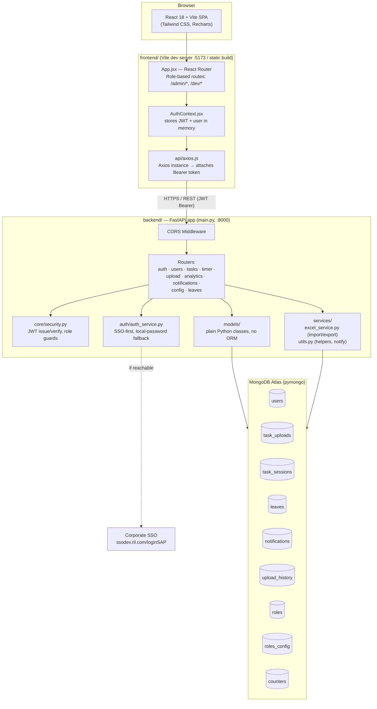

# DevTracker

**Internal Developer Activity & Productivity Tracking System — H.N. Reliance Hospital**

DevTracker is a full-stack internal tool that lets developers and interns log the work they do (tickets, tasks, time spent), and lets Admins/Managers view team-wide progress, productivity percentages, leaves, and reports — with Excel import/export built in.

- **Backend:** FastAPI (Python) + MongoDB
- **Frontend:** React 18 + Vite + Tailwind CSS
- **Auth:** JWT, with an optional Corporate SSO fallback flow

---

## Table of Contents

1. [Features](#1-features)
2. [Architecture Diagram](#2-architecture-diagram)
3. [Tech Stack](#3-tech-stack)
4. [Project / Folder Structure — What Each File Does](#4-project--folder-structure--what-each-file-does)
5. [Database Schema (MongoDB)](#5-database-schema-mongodb)
6. [How Productivity is Calculated](#6-how-productivity-is-calculated)
7. [Roles & Permissions](#7-roles--permissions)
8. [API Overview](#8-api-overview)
9. [Setup & Running Locally](#9-setup--running-locally)
10. [Environment Variables](#10-environment-variables)

---

## 1. Features

### For Developers / Interns
- **Task logging** — log tickets manually (title, description, priority, module, ticket/CD number, functional team, etc.) or via **Excel upload**.
- **Live work timer** — Start / Pause / Resume / Switch / Complete a timer per task. Switching tasks auto-pauses whatever was previously running, and every start/resume creates a new timed **session** so multiple work sessions on the same ticket are tracked separately.
- **Personal dashboard** — today's logged hours, this week's total, active task with a live-updating timer, work-in-progress vs completed tasks.
- **My Logs** — view/edit/delete your own tasks, filter by status/date.
- **Apply for leave** — submit leave requests; approved or not, leave days automatically reduce your weekly productivity target (see [§6](#6-how-productivity-is-calculated)).
- **Notifications** — get notified (e.g. when an admin assigns you a task or uploads on your behalf).
- **Export** — download your own logs as Excel/CSV.

### For Admin / Manager
- **Team dashboard** — aggregated KPIs across all developers.
- **Weekly Productivity view** — per-developer breakdown of hours logged vs. an expected 40-hour work week, auto-adjusted for approved leave, with a productivity **%**.
- **User Management** — create/update/deactivate developer, intern, and manager accounts; assign roles and dev types (e.g. react/SAP/etc.).
- **Task assignment** — assign tickets to specific developers on their behalf.
- **Excel bulk upload** — upload a whole week's worth of ticket logs for the team in one go, with a validate/dry-run step before committing.
- **Reports & Export** — export filtered task data to Excel or CSV for any date range, user, or status.
- **Upload window config** — control which roles are allowed to upload and during what date window (`roles_config`).
- **Leave oversight** — view all leave requests across the team.

---

## 2. Architecture Diagram



**Request flow, in plain terms:**
1. The React SPA logs in via `POST /api/auth/login`. The backend first checks whether the corporate SSO endpoint is reachable; if yes it authenticates against SSO and auto-provisions/syncs a local user record, otherwise it falls back to a local bcrypt password check.
2. A JWT (containing `user id` + `role`) is returned and stored client-side; every subsequent request carries it as a `Bearer` token.
3. FastAPI dependency-injects the current user via `get_current_user`, and route-level guards (`require_admin`, `require_admin_or_manager`, etc.) enforce role-based access.
4. All persistence goes through **pymongo** straight to MongoDB collections — there is **no ORM**; the "models" are plain Python classes with `to_dict()`/constructor mapping, and auto-incrementing integer IDs are generated via a `counters` collection (Mongo has no native auto-increment).

---

## 3. Tech Stack

| Layer | Technology |
|---|---|
| Frontend | React 18, Vite, React Router v6, Tailwind CSS, Recharts (charts), Lucide (icons), Axios |
| Backend | FastAPI, Uvicorn, Pydantic v2 / pydantic-settings |
| Database | MongoDB (via `pymongo`), accessed with no ORM — plain dict documents |
| Auth | python-jose (JWT), passlib + bcrypt (password hashing), optional corporate SSO fallback |
| Excel | pandas + openpyxl (import/export/template generation) |

---

## 4. Project / Folder Structure — What Each File Does

```
Ril_DevTracker/
├── backend/
│   ├── main.py                     # FastAPI app entrypoint: CORS, router registration, /health
│   ├── seed.py                     # One-time script: seeds default roles + role upload-window configs
│   ├── requirements.txt            # Python dependencies
│   └── app/
│       ├── core/
│       │   ├── config.py           # Settings (Mongo URL, JWT secret, SSO URL) via pydantic-settings
│       │   ├── database.py         # Mongo client/db handle, get_next_sequence_value(), index creation
│       │   └── security.py         # Password hashing, JWT create/decode, role-guard dependencies
│       ├── auth/
│       │   └── auth_service.py     # Login orchestration: SSO reachability check → SSO or local auth
│       ├── models/                 # Plain Python classes mapping to Mongo documents (see §5)
│       │   ├── user.py             # User
│       │   ├── task.py             # TaskUpload + TaskSession
│       │   ├── leave.py            # Leave
│       │   ├── notification.py     # Notification
│       │   ├── upload.py           # UploadHistory
│       │   └── role.py             # Role + RolesConfig
│       ├── schemas/                 # Pydantic request/response schemas (validation layer)
│       ├── routes/
│       │   ├── auth.py              # /api/auth — login, register, me
│       │   ├── users.py             # /api/users — CRUD for user accounts (admin-only for create/update)
│       │   ├── tasks.py             # /api/tasks — create/list/update/delete tickets, role-scoped visibility
│       │   ├── timer.py             # /api/timer — start/pause/resume/switch/complete, live session tracking
│       │   ├── upload.py            # /api/upload — Excel bulk import, validation dry-run, template download
│       │   ├── analytics.py         # /api/analytics — personal + team dashboards, weekly productivity engine
│       │   ├── notifications.py     # /api/notifications — list/read notifications
│       │   ├── config.py            # /api/config — role upload windows, Excel/CSV export
│       │   └── leaves.py            # /api/leaves — apply/list/delete leave requests
│       └── services/
│           ├── excel_service.py     # Parses/validates/imports uploaded Excel workbooks into task_uploads
│           └── utils.py             # seconds→hours helper, upload-window check, admin notification helper
│
└── frontend/
    ├── index.html                  # Vite HTML entry
    ├── vite.config.js / tailwind.config.js / postcss.config.js
    └── src/
        ├── main.jsx                # React root render
        ├── App.jsx                 # Route table — maps URLs to pages, role-gated via ProtectedRoute
        ├── api/axios.js            # Preconfigured Axios instance (base URL + auth header injection)
        ├── context/
        │   ├── AuthContext.jsx     # Holds logged-in user + JWT, login()/logout()
        │   └── ToastContext.jsx    # Global toast/notification popups
        ├── components/
        │   ├── ProtectedRoute.jsx  # Redirects unauthenticated/unauthorized users
        │   ├── layout/             # Sidebar.jsx, Topbar.jsx, Layout.jsx — app shell/navigation
        │   ├── shared/             # KpiCard, LoadingSpinner, EmptyState, ToastContainer
        │   └── task/               # TaskCard, LiveTimer, QuickAddForm
        ├── pages/
        │   ├── auth/Login.jsx
        │   ├── dev/                # DevDashboard, MyLogs, LogEntryForm — developer/intern views
        │   └── admin/              # AdminDashboard, UserManagement, ExcelUpload, Reports — admin/manager views
        ├── constants/index.js      # Shared enums/lookups (statuses, priorities, tracks, etc.)
        └── utils/badges.jsx        # Status/priority → colored badge mapping
```

---

## 5. Database Schema (MongoDB)

### `users`
| Field | Type | Notes |
|---|---|---|
| `id` | int | PK (app-generated via `counters`) |
| `username` | string | **unique index** |
| `email` | string | **unique, sparse index** |
| `password_hash` | string | bcrypt hash |
| `full_name` | string | |
| `role` | string | `admin` \| `manager` \| `developer` \| `intern` |
| `dev_type` | string | e.g. `react`, `sap`, etc. — developer's tech track |
| `domain` | string | derived from email domain (or SSO) |
| `is_active` | bool | soft-delete / deactivation flag |
| `created_at` | datetime | |

### `task_uploads` (the core "ticket / work log" table)
| Field | Type | Notes |
|---|---|---|
| `id` | int | PK |
| `ticket_id` | string | auto-generated `SR-0001` format, **unique, sparse index** |
| `user_id` | int → `users.id` | owner/assignee |
| `task_title`, `description` | string | |
| `status` | string | `in_progress` \| `completed` |
| `priority` | string | `low` \| `medium` \| `high` (default `medium`) |
| `start_date`, `due_date` | date | |
| `completed_at` | datetime | set when marked complete |
| `hours_logged` | decimal | manually entered or derived from timer |
| `total_seconds` | int | authoritative time-tracking total (see §6) |
| `timer_status` | string | `idle` \| `active` \| `paused` \| `completed` |
| `track`, `dev_type_task`, `type_of_development`, `module`, `category` | string | classification fields, mostly used for reporting |
| `cd_number` | string | change-document / project reference number |
| `functional_team` | string | |
| `assigned_by` | int → `users.id`, nullable | set when an admin/manager assigns the task to someone else |
| `upload_source` | string | `manual` \| `excel` |
| `upload_history_id` | int → `upload_history.id`, nullable | links rows imported via Excel back to the batch |
| `file_name` | string | original Excel filename, if imported |
| `remarks` | string | |
| `created_at`, `updated_at` | datetime | |

### `task_sessions` (one row per Start→Pause/Complete timer session)
| Field | Type | Notes |
|---|---|---|
| `id` | int | PK |
| `task_id` | int → `task_uploads.id` | |
| `user_id` | int → `users.id` | |
| `session_number` | int | 1, 2, 3… per task |
| `started_at` | datetime | |
| `paused_at` | datetime, nullable | set on pause |
| `ended_at` | datetime, nullable | set on complete |
| `duration_seconds` | int | computed elapsed time for this session |

### `leaves`
| Field | Type | Notes |
|---|---|---|
| `id` | int | PK |
| `user_id` | int → `users.id` | |
| `developer_name` | string | denormalized for quick display |
| `from_date`, `to_date` | date | |
| `reason` | string | |
| `total_days` | int | weekdays only (Sat/Sun excluded) |
| `created_at` | datetime | |

### `notifications`
| Field | Type | Notes |
|---|---|---|
| `id` | int | PK |
| `recipient_id` | int → `users.id` | |
| `triggered_by` | int → `users.id`, nullable | who caused the notification |
| `message` | string | |
| `notif_type` | string | e.g. `upload` |
| `is_read` | bool | |
| `created_at` | datetime | |

### `upload_history` (metadata for every Excel bulk import)
| Field | Type | Notes |
|---|---|---|
| `id` | int | PK |
| `uploaded_by` | int → `users.id` | |
| `week_label`, `sheet_name`, `original_filename` | string | |
| `source` | string | default `excel` |
| `total_rows`, `valid_rows`, `error_rows` | int | import outcome summary |
| `uploaded_at` | datetime | |

### `roles`
| Field | Type | Notes |
|---|---|---|
| `id` | int | PK |
| `name` | string | `admin` / `manager` / `developer` / `intern` |
| `permissions` | string (JSON array) | e.g. `["view_all","edit_task",...]` |
| `access_level` | int | 4 (admin) → 1 (intern) |
| `created_at` | datetime | |

### `roles_config`
| Field | Type | Notes |
|---|---|---|
| `id` | int | PK |
| `role_name` | string | which role this config applies to |
| `domain` | string, nullable | |
| `upload_allowed` | bool | whether this role can currently bulk-upload |
| `upload_window_start`, `upload_window_end` | date | date window during which uploads are permitted |
| `created_at` | datetime | |

### `counters` (internal helper, not a business entity)
Single document per sequence name (e.g. `user_id`, `task_id`, `session_id`, `leave_id`, `role_id`, `roles_config_id`) — atomically incremented via `find_one_and_update` to emulate auto-increment integer IDs in MongoDB.

**Entity relationships (conceptual):**
```
users (1) ───< task_uploads (assignee, via user_id)
users (1) ───< task_uploads (assigner, via assigned_by, nullable)
task_uploads (1) ───< task_sessions
users (1) ───< task_sessions
users (1) ───< leaves
users (1) ───< notifications (as recipient / triggered_by)
users (1) ───< upload_history (uploaded_by)
upload_history (1) ───< task_uploads (rows from that batch)
roles (1) ─── roles_config (by role_name)
```

---

## 6. How Productivity is Calculated

This is the heart of `GET /api/analytics/weekly-productivity`:

1. For each **active developer/intern**, gather:
   - All `task_sessions` **started within the target week** (Mon–Sun).
   - All `task_uploads` whose `start_date` falls in that week (to also capture manually-entered hours that weren't tracked live).
2. For every task touched that week, sum:
   - Time from actual timer **sessions** that occurred that week, **plus**
   - Any "manual" time (`total_seconds` minus all-time session time) if the task's `start_date` is in that week — this avoids double-counting time that was already logged via the live timer.
3. Sum this across all the developer's tasks → **total minutes worked** that week.
4. **Target time** = 40 hours (2400 minutes) for a full week, **minus 8 hours for every weekday of approved leave** in that week (`leaves` collection — any submitted leave counts immediately, no separate approval step).
5. **Productivity % = (total minutes worked ÷ target minutes) × 100**, rounded to the nearest integer. If the developer is on leave the entire week (target = 0), productivity defaults to **100%**.

This gives Admins/Managers a per-developer weekly productivity percentage, a breakdown of every task worked on that week, and total hours — all visible in the **Reports** / **Admin Dashboard** pages, with Excel export.

---

## 7. Roles & Permissions

| Role | Access Level | Can do |
|---|---|---|
| **admin** | 4 | Everything: manage users, assign tasks, configure upload windows, view/export all reports |
| **manager** | 3 | View all developers' work, assign tasks, upload on behalf of team, view/export reports (cannot manage users) |
| **developer** | 2 | Log/edit/delete **own** tasks, use timer, apply for leave, upload own Excel sheets (if window open) |
| **intern** | 1 | Same as developer but narrower default permissions (`view_own`, `log_hours`) |

Role enforcement happens both in the backend (`require_admin`, `require_admin_or_manager` dependencies on routes) and in the frontend (`<ProtectedRoute roles={[...]}>` wrapping page routes).

---

## 8. API Overview

Interactive docs are auto-generated by FastAPI once the backend is running:
- Swagger UI → `http://localhost:8000/docs`
- ReDoc → `http://localhost:8000/redoc`

| Prefix | Purpose |
|---|---|
| `/api/auth` | login, register, current user |
| `/api/users` | user CRUD (admin) |
| `/api/tasks` | ticket/task CRUD, role-scoped |
| `/api/timer` | start/pause/resume/switch/complete timer, live status |
| `/api/upload` | Excel bulk import, validation, template download |
| `/api/analytics` | personal dashboard, admin dashboard, weekly productivity (+ export) |
| `/api/notifications` | list/read notifications |
| `/api/config` | role upload-window config, Excel/CSV export |
| `/api/leaves` | apply/list/delete leave requests |

---

## 9. Setup & Running Locally

### Prerequisites
- Python 3.10+
- Node.js 18+
- A MongoDB connection string (Atlas or local `mongod`)

### Backend
```bash
cd backend
python -m venv venv
source venv/bin/activate        # Windows: venv\Scripts\activate
pip install -r requirements.txt

# Create a .env file (see §10) — do NOT rely on the default in config.py
cp .env.example .env             # create this file yourself, see below

# Seed default roles + role configs (run once)
python seed.py

# Start the API
uvicorn main:app --reload --port 8000
```
API will be live at `http://localhost:8000`, docs at `http://localhost:8000/docs`.

### Frontend
```bash
cd frontend
npm install
npm run dev
```
App will be live at `http://localhost:5173` (Vite dev server), and is already configured (in `main.py` CORS) to talk to the backend at `http://localhost:8000`.

### Production build (frontend)
```bash
cd frontend
npm run build      # outputs static files to frontend/dist
npm run preview    # preview the production build locally
```

---

## 10. Environment Variables

Create `backend/.env` (this is read automatically by `pydantic-settings`):

```env
MONGO_URL=your-mongodb-connection-string-here
SECRET_KEY=a-long-random-secret-used-to-sign-jwts
ALGORITHM=HS256
ACCESS_TOKEN_EXPIRE_MINUTES=480
APP_NAME=DevTracker
AUTH_MODE=auto            # "auto" | "local" | "sso"
SSO_LOGIN_URL=https://ssodev.ril.com/loginSAP
```

- `AUTH_MODE=auto` — tries corporate SSO first, falls back to local bcrypt password auth if SSO is unreachable.
- `AUTH_MODE=local` — always use local password auth (useful for local dev without VPN access).
- `AUTH_MODE=sso` — force SSO only.

---
